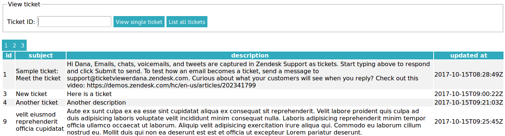

# Ticket Viewer

Client and server-side code for Ticket Viewer application, to display ticket information for a Zendesk account.

Front end: Javascript browser client. Compatible with Firefox and Chrome.

Back end: Python using the `flask` library. Compatible with python 2.x and 3.x



# Installation
To install the required python package dependencies using [pip](https://pip.pypa.io/en/stable/installing/), run `pip install flask requests`.

# Usage
To run the server:

```
python backend/server.py
```

The app may then be accessed by opening `frontend/client.html` in the browser.

## Running tests
Python unit tests may be run using [pytest](https://docs.pytest.org/en/latest/) in python **3.x**

Alternatively, if pytest is not installed, tests may be run from the `backend` directory with the command:

```
python -m unittest test_*
``` 

